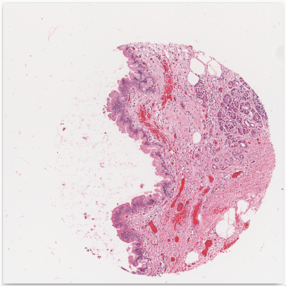
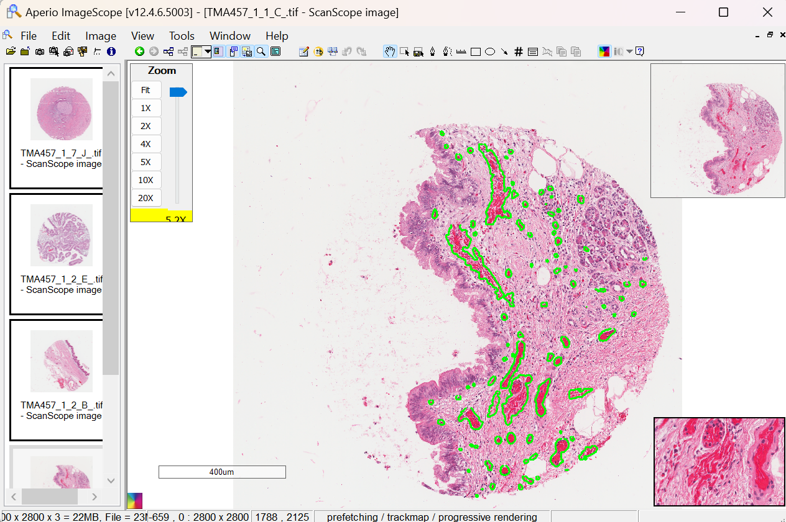
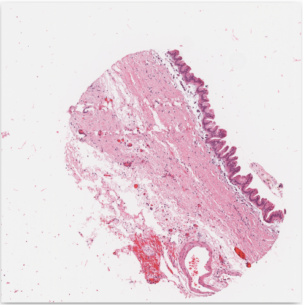

# HistoPathology Slides Processing Pipeline
This repository is a complete package which deals with Whole Slide Histopathological Images. We perform custom user demanded segmentations using state of the art machine learning models on WSI! We also visualize results on eminent user friendly softwares for pathologists (Aperio)
<table>
  <tr>
    <td style="text-align: center;">
      <p><strong>Input Slide</strong></p>
      
    </td>
    <td style="text-align: center;">
      <p><strong>Restitched Inference</strong></p>
      
    </td>
    <td style="text-align: center;">
      <p><strong>Visualization in Aperio</strong></p>
      
    </td>
  </tr>
</table>

# 📍 Implementations

 ### 1. Create annotation and image patches from given WSI 
 ### 2. Train, transfer learn or fine-tune models 
 ### 3. Run inference on the trained model 
 ### 4. Visualize results 

## Setting Up Environment for Windows Machines
1. Create conda environment
   
```bash
conda create --name path-process python=3.10
```
2. Activate conda environment
```bash
conda activate path-process
```
3. Install pytorch
```bash
pip3 install torch torchvision torchaudio --index-url https://download.pytorch.org/whl/cu121
```
4. Install openslide
```bash
pip install openslide-python
```
5. Download and copy openslide binaries from [here](https://openslide.org/api/python/#basic-usage)
6. Update path-to-baniries and test openslide using
```bash
test-open-slide.py
```
7. Install other requirements
```bash
pip install -r requirements.txt
```


 <p align="center"> </p>
 <p align="center"> </p>
<p align="center">
  
  
</p>


<p align="center">
  
  
</p>
 
