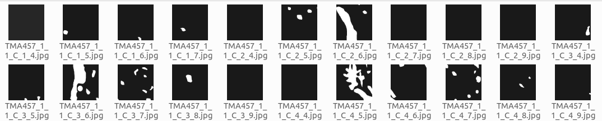

# HistoPathology Slides Processing
This repository is a complete package which deals with Whole Slide Histopathological Images.

# 📍 Implementations

 ### 1. Create annotation and image patches from given WSI 
 
 <p align="center"> </p>
 <p align="center"> </p>

 ### 2. Create annotation patches 
 ### 3. Train, transfer learn or fine-tune models 
 ### 4. Run inference on the trained model 
 ### 5. Visualize results 

<p align="center">
  
  
</p>

## Deliverables
###  

## Setting Up Environment for Windows Machines

1. Create conda environment
```bash conda create --name path-process python=3.10```
2. Activate conda environment
```bash conda activate path-process```
3. Install pytorch
```bash pip3 install torch torchvision torchaudio --index-url https://download.pytorch.org/whl/cu121```
4. Install openslide
```bash pip install openslide-python```
5. Download and copy openslide binaries from [here](https://openslide.org/api/python/#basic-usage)
6. Update path-to-baniries and test openslide using ```bash test-open-slide.py```
7. Install other requirements
```bash pip install -r requirements.txt```

 
