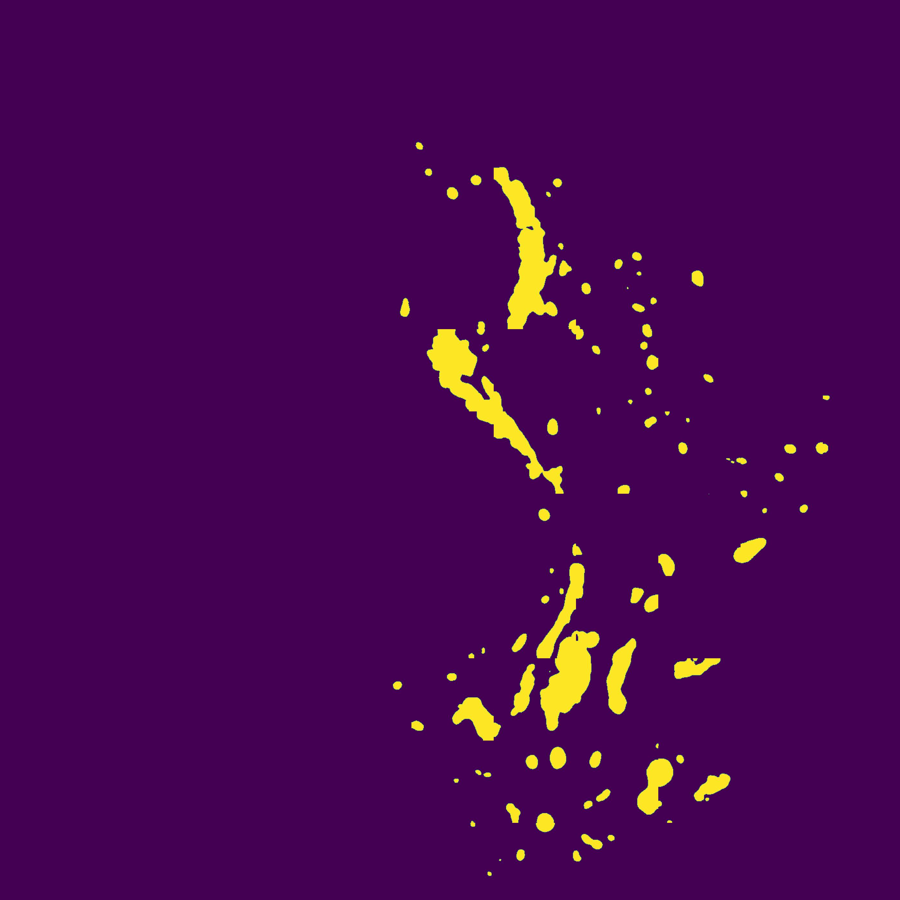

# HistoPathology Slides Processing Pipeline

This repository is a complete package which deals with Whole Slide Histopathological Images. We perform custom user demanded segmentations using state of the art machine learning models on WSI! We also visualize results on eminent user friendly softwares for pathologists (Aperio)

<table>
  <tr>
    <td style="text-align: center;">
      <p><strong>Input Slide</strong></p>
      
    </td>
    <td style="text-align: center;">
      <p><strong>Restitched Inference</strong></p>
      
    </td>
    <td style="text-align: center;">
      <p><strong>Visualization in Aperio</strong></p>
      
    </td>
  </tr>
</table>

# 🚀 Updates

- [2024.07.31] Added support for Segformer-B5 based Training and Inference!
- [2024.07.31] Results Visualization in Aperio Image Scope 🔥
- [2024.06.10] Added support for SAM based Training and Inference!
- [2024.06.03] Added support for Unet based Training and Inference!

# 📍 Implementations

##### 1. Create annotation and image patches from given WSI

##### 2. Train, transfer learn or fine-tune models

##### 3. Run inference on the trained model

##### 4. Restitch Inference patches and Visualize results

## Setting Up Environment for Windows Machines

1. Create conda environment

```bash
conda create --name path-process python=3.10
```

2. Activate conda environment

```bash
conda activate path-process
```

3. Install pytorch

```bash
pip3 install torch torchvision torchaudio --index-url https://download.pytorch.org/whl/cu121
```

4. Install openslide

```bash
pip install openslide-python
```

5. Download and copy openslide binaries from [here](https://openslide.org/api/python/#basic-usage)
6. Update path-to-baniries and test openslide using

```bash
test-open-slide.py
```

7. Install other requirements
   `pip install -r requirements.txt`

# To-do @Ali and @Ashwin

1. Code to re-stitch and visualize the pathes and their annotaitons in Aperio Imagescope
2. Code to identify patches that are tissue but have no groud truth.:
   Can be found via the create_patches.ipynb notebook.
3. Model training and validation using the created dataset
4. Model testing and inference:
   Can be found via the inference.ipynb notebook.
5. Result visualiztion:
   Can be found via the inference.ipynb notebook.
